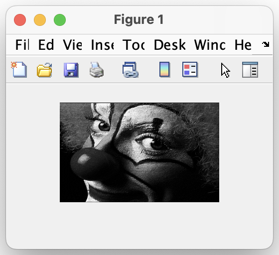

# Lab1 - Introduction

<aside>
👁️ Images and Image Processing

</aside>

## Workspace Setup

First I created `cc.m`, a utility file co close everything. I use this file in all workspaces as a time saver.

```matlab
>> close all
>> clear all
>> clc
```

## Image

Once the image data are downloaded, the image can be loaded and displayed:

```matlab
>> load clown
>> imshow(clown)
```



## Rotate

In order to rotate an image, simple matrix multiplication can be used:

$$
\begin{pmatrix}
x_{destination} \\
y_{destination}
\end{pmatrix} = \begin{pmatrix}
cos(\theta) & sin(\theta)\\
-sin(\theta) & cos(\theta)
\end{pmatrix}(\begin{pmatrix}
x_{source} \\
y_{source}
\end{pmatrix}-\begin{pmatrix}
x_{centre} \\
y_{centre}
\end{pmatrix}) + \begin{pmatrix}
x_{centre} \\
y_{centre}
\end{pmatrix}
$$

However, because of the rounding required, this means that there may be gaps in the output image (where multiple input pixels get mapped onto the same output pixel, leaving gaps elsewhere). To solve this, we can work backwards:

$$
\begin{pmatrix}
x_{source} \\
y_{source}
\end{pmatrix} = \begin{pmatrix}
cos(\theta) & sin(\theta)\\
-sin(\theta) & cos(\theta)
\end{pmatrix}^{-1}(\begin{pmatrix}
x_{destination} \\
y_{destination}
\end{pmatrix}-\begin{pmatrix}
x_{centre} \\
y_{centre}
\end{pmatrix}) + \begin{pmatrix}
x_{centre} \\
y_{centre}
\end{pmatrix}
$$

A function `Rotate` can be created in a file `Rotate.m`

```matlab
function [Rotated] = Rotate(Input, Theta)
% Rotate Input image by theta DEGREES.

%% Transformation Matrix
mat = [
    cos(deg2rad(Theta)) sin(deg2rad(Theta));
    -sin(deg2rad(Theta)) cos(deg2rad(Theta))
    ]; % Forward

inverse = inv(mat); % Reverse

%% Image Parameters (ROW matrices)
W = size(Input,1); % Width
H = size(Input,2); % Height
C = [round(W/2), round(H/2)]; % Centre point

%% Backward Loop Method
for y = 1 : H
    for x = 1 : W
        P = [x, y];
        x_src = round(inverse * (P - C)' + C'); % Find source of P

        if x_src(1)< 1 | x_src(1) > W | x_src(2) < 1 | x_src(2) > H
            Rotated(x, y) = 0;
        else
            Rotated(x, y) = Input(x_src(1), x_src(2));
        end
    end
end
```

When called as `Rotate(image, angle (degrees))`, the function will rotate matrix representations of images:


## Shear

A shear matrix is of the form $\begin{pmatrix}1 & X Shear\\Y Shear & 1\end{pmatrix}$. Exactly the same logic can be applied as above, so we perform the operation in reverse:

```matlab
function [Sheared] = Shear(Input, X, Y)
% Shear the image by X and Y in x and y directions.

%% Transformation Matrix
mat = [
    1 X;
    Y 1
    ]; % Forward

inverse = inv(mat); % Reverse

%% Image Parameters (ROW matrices)
W = size(Input,1); % Width
H = size(Input,2); % Height
C = [round(W/2), round(H/2)]; % Centre point

%% Backward Loop Method
for y = 1 : H
    for x = 1 : W
        P = [x, y];
        x_src = round((P - C) * inverse + C); % Find source of P

        if x_src(1)< 1 | x_src(1) > W | x_src(2) < 1 | x_src(2) > H
            Sheared(x, y) = 0;
        else
            Sheared(x, y) = Input(x_src(1), x_src(2));
        end
    end
end
```

When called as `Shear(image, 1, 0)`, the function will shear matrix representations of images:

